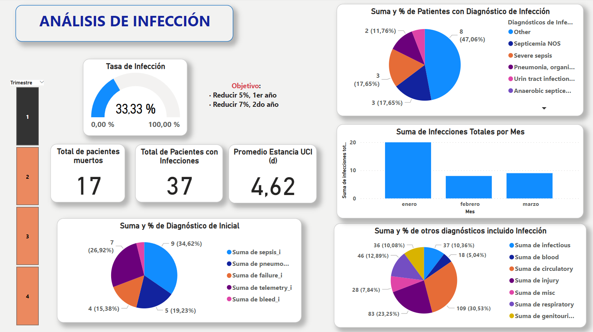
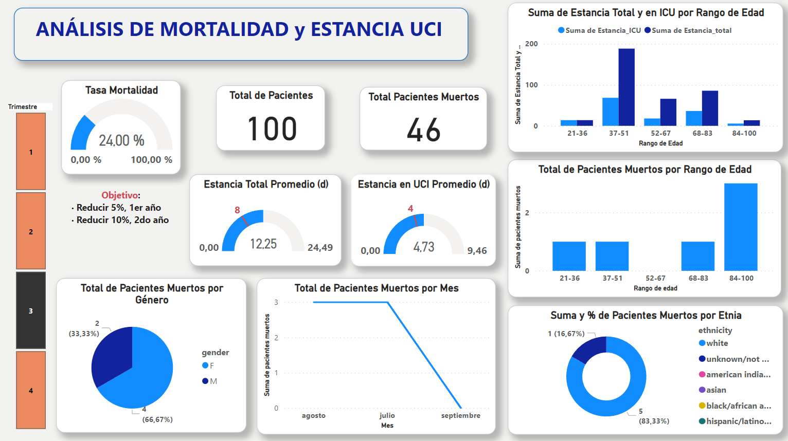
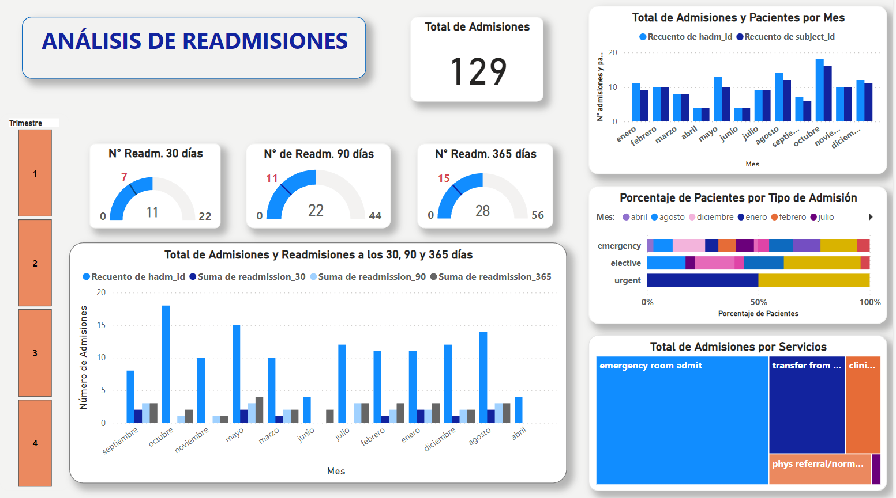
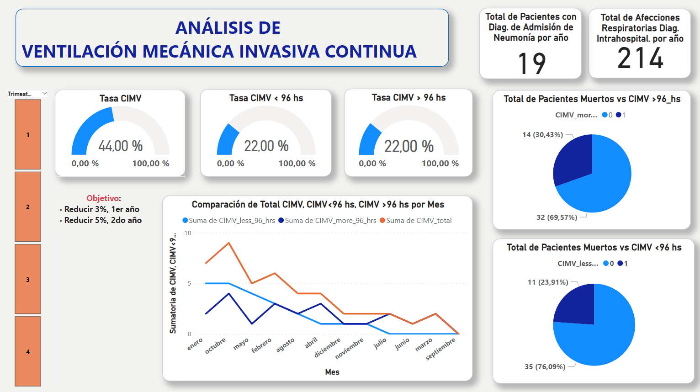

***UNIDAD DE CUIDADOS INTENSIVOS***

**KPI de Infecciones**

**KPI de Mortalidad y Estancia en UCI**

**KPI de Readmisiones**

**KPI de Ventilacion Mecanica Invasiva Continua**

**MODELO DE PREDICCION DE ESTANCIA EN LA UCI**
Para interactuar con el modelo de prediccion, da clic [acá](Link https://juanrs26-pf-cuidados-intensivos-modelstay-sne0xn.streamlit.app/)